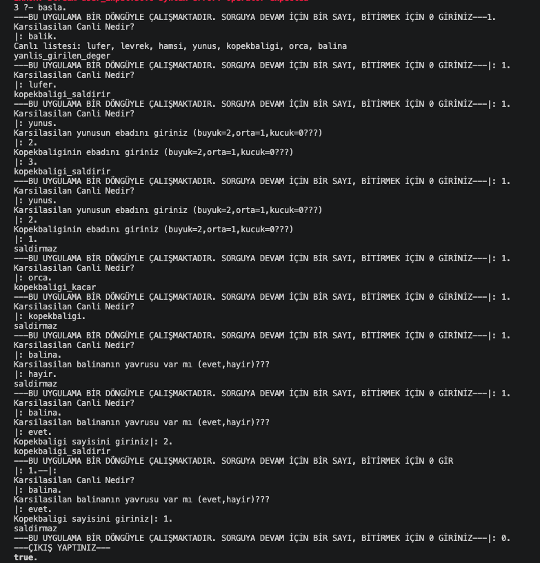
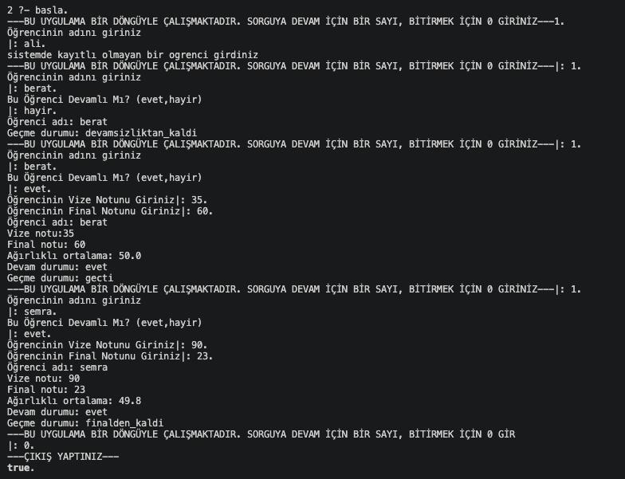

# Prolog Rule-Based Expert Systems

This repository contains two different rule-based expert systems developed in Prolog. Both systems process user inputs interactively through a decision loop and make logical deductions based on predefined rules.

---

## 🦈 Proje 1: Köpekbalığı Saldırı Tahmini

Bir köpekbalığının karşılaştığı deniz canlısına göre nasıl davranacağı Prolog ile modellenmiştir. Sistem, kullanıcıdan karşılaşılan canlıyı almalı ve gerekiyorsa ek sorular sorarak karar vermelidir.

### 📋 Kurallar

- **Küçük Balıklar (Lüfer, Levrek, Hamsi):** Köpekbalığı lüfer gibi küçük balıklarla karşılaşırsa sonuç `saldirir` olmalıdır.
- **Yunus:** Yunus ile karşılaşırsa önce yunusun boyutu değerlendirilmelidir. Yunus köpekbalığından küçükse sonuç `saldirir`, değilse `saldirmaz` olmalıdır.
- **Orca:** Orca ile karşılaşırsa sonuç her zaman `kacar` olmalıdır.
- **Balina:** Balina ile karşılaşırsa sistem önce _‘balina yavrusu var mı?’_ diye sormalıdır. Cevap hayır ise sonuç `saldirmaz` olmalıdır. Eğer cevap evet ise sistem bu kez _‘kaç köpekbalığı var?’_ diye sormalıdır. Köpekbalığı sayısı birden fazlaysa sonuç `saldirir`, değilse `saldirmaz` olmalıdır.

### 📊 Output

---

## 🎓 Proje 2: Öğrenci Geçti-Kaldı Analizi

Bir öğrencinin dersten geçip geçmediğini belirleyen Prolog sistemi geliştirilecektir. Sistem kullanıcıdan öğrenci adı, ders adı, vize notu, final notu ve devamsızlık durumunu almalıdır.

### 📋 Kurallar

- **Başarı Notu Hesaplama:** Genel başarı notu vizenin %40’ı ve finalin %60’ı alınarak hesaplanmalıdır.
- **Final Barajı:** Final notu 50’nin altındaysa öğrenci `finaldenkaldi` sonucunu almalıdır.
- **Ortalama Barajı:** Ortalama 60’ın altındaysa `ortalamadankaldi` sonucu verilmelidir.
- **Devamsızlık Durumu:** Devamsızlık sınırı aşılmışsa notlara bakılmadan sonuç `devamsizliktankaldi` olmalıdır.
- **Geçme Durumu:** Tüm şartlar sağlanıyorsa sonuç `gecti` olmalıdır.

### 📊 Output 

