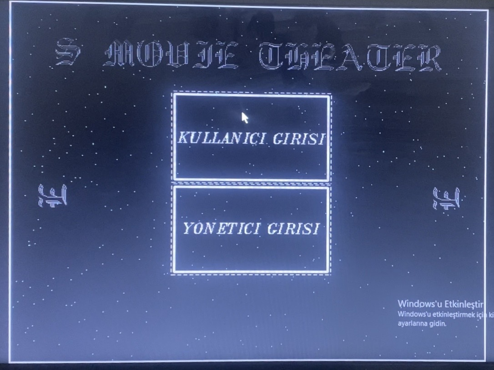
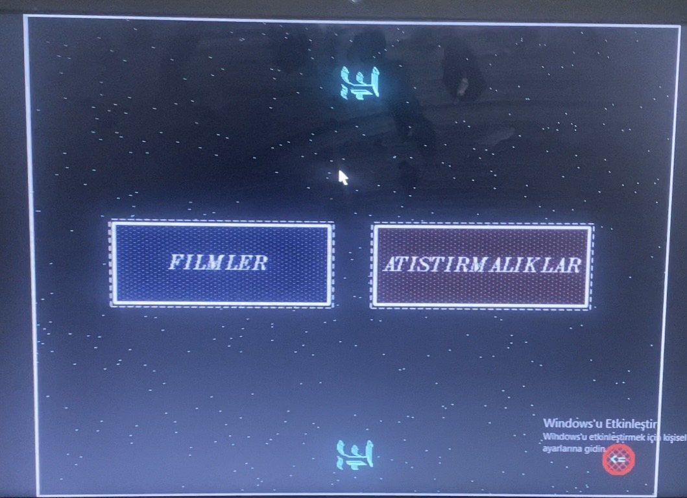
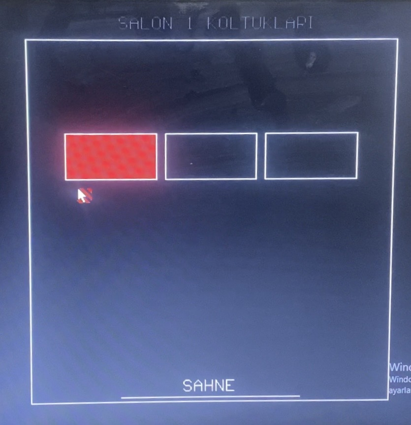

# 🎬 MS-DOS Legacy Sinema Otomasyon Sistemi (Turbo C)

**Programlama-II bitirme projesi**

Bu proje, modern arayüz (UI) kütüphanelerinin olmadığı bir dönemde, doğrudan **MS-DOS** ortamında hardware interrupts ve temel grafik algoritmaları kullanılarak sıfırdan geliştirilmiş bir sinema salonu yönetim otomasyonudur.

Bu sistem ile bilgisayar bilimleri ve veritabanı yönetimi temellerine yönelik bir yolculuk yapılmıştır.

Bu senenin ardından C# ile Görsel Programlamaya Giriş dersinde yaşadığım sevinç tarif edilemez

---

## 🚀 Teknik Altyapı ve Öne Çıkan Özellikler

Günümüzdeki sürükle-bırak butonların aksine, bu projede her şey matematiksel hesaplamalar ve işletim sistemi çağrılarıyla manuel olarak inşa edilmiştir:

- **Donanım Seviyesinde Fare Kontrolü (DOS Interrupts):** Farenin ekrandaki koordinatlarını ve tıklama durumunu okumak için işletim sistemini atlayarak doğrudan işlemciye `int86(0x33, &i, &o)` komutuyla interrupt sinyalleri gönderilmiştir.
- **Manuel Hitbox Oluşturma:** Ekranda çizilen koltukların veya menü elemanlarının tıklanabilir olması için oyun motorlarındakine benzer bir "Hitbox" mantığı kurulmuştur. Farenin x ve y koordinatları `(x1>=(getmaxx()/2-160) && x1<=(getmaxx()/2-60))` gibi algoritmalarla hesaplanarak sanal butonlar oluşturulmuştur.
- **Durum Yönetimi ve Veritabanı:** Satılan biletlerin, kalan patlamış mısır ve içecek stoklarının program kapatıldığında bile saklanması için `f.txt`, `a.txt`, `c.txt` gibi dosyalara okuma/yazma işlemleri yapılarak kalıcı bir veri tabanı simüle edilmiştir.
- **Borland Graphics Interface (BGI):** `<graphics.h>` kütüphanesi kullanılarak pikseller, geometrik şekiller (`rectangle`, `circle`, `floodfill`) ve menü arayüzleri piksel piksel ekrana çizdirilmiştir.

---

## 🛠️ Sistemin Çalışma Mantığı

Sistem iki ana modül üzerinden çalışmaktadır:

1. **Yönetici Girişi (Admin Panel):** Sinema salonlarındaki tüm koltukları ve atıştırmalık stoklarını sıfırlayıp yeni güne hazırlayan kontrol modülü.
2. **Kullanıcı Girişi (User Panel):** Kullanıcıların interaktif menülerde dolaşabildiği, filmlere bilet alabildiği, dolu koltukların kırmızı ile işaretlendiği (`SOLID_FILL, RED`) ve sanal büfeden mısır/kola satın alabildiği ana modül.

---

## ⚙️ Kurulum ve Çalıştırma (Modern Sistemler İçin)

Bu kod, modern Windows, macOS veya Linux sistemlerinde doğrudan derlenemez. Efsanevi **Turbo C++ 3.0** derleyicisi için yazılmıştır. Günümüzde bu kodu çalıştırmak ve test etmek için:

1. Bilgisayarınıza **DOSBox** (MS-DOS Emülatörü) kurun.
2. İçine Turbo C++ 3.0 (veya Borland C++) yükleyin.
3. Kodu derleyicinin içine alıp çalıştırın.
   _(Not: Veritabanı okuma/yazma işlemleri için `C:\\TURBOC3\\BIN` yolunda ilgili `.txt` dosyalarının bulunması gerekmektedir.)_

---
